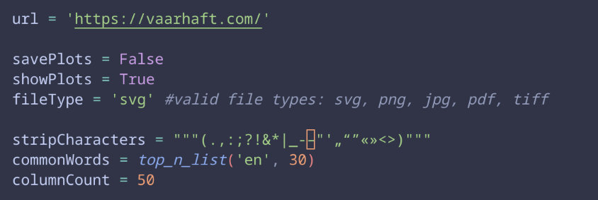
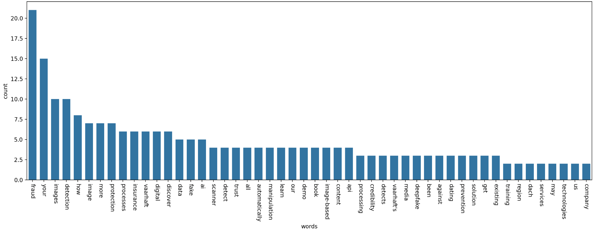
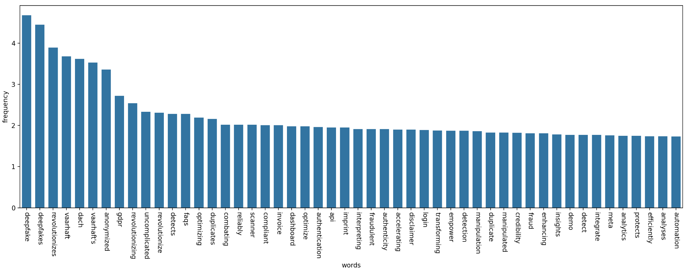
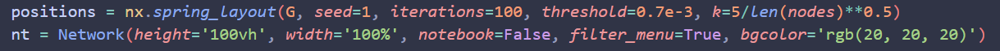

# BuzzWordAnalyzer

A fun little project, that analyses and visualizes the word usage of a website

## Settings

| variable | explanation |
| -------- | ----------- |
| url      | url of website you want to analyse |
| savePlots | Boolean, True if you want to save the created plots as files |
| showPlots | Boolean, True if you want to show the plots in an extra matplotlib window |
| fileType | if savePlots is set to True, this controls the file type of the saved plots |
| stripCharacters | a set of characters that get removed from the beginning and end of each found word |
| commonWords | list of common english words, that are excluded from the analysis of the found words |
| columnCount | Integer, number columns that are shown on the plots (for example top 50 words with highest count) |

## Plots

### Word Count Plot

the word count plot shows the top $x$ most counted words on the website. The number of words displayed is controlled by the columnCount variable.

the word frequency plot shows the top $x$ words with the hightest relative frequency score on the website (observed frequency / expected frequency per billion words)

## Word Graph

The size of the nodes represent the count value of the word. The bigger the node, the more it was used on the website.

The color of a node represents its relative frequency value (observed frequency / expected frequency). Red means, that a uncommon word was used unusually often. Blue means the exact opposite. The distance of the nodes in the word graph is controlled by the average distance (number of words) two words have to each other on the website. The aesthetics of the graph can be customized in the visualize_graph() function:

